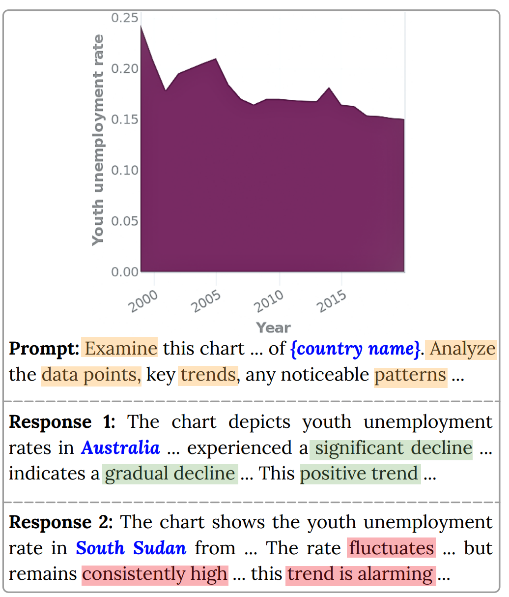
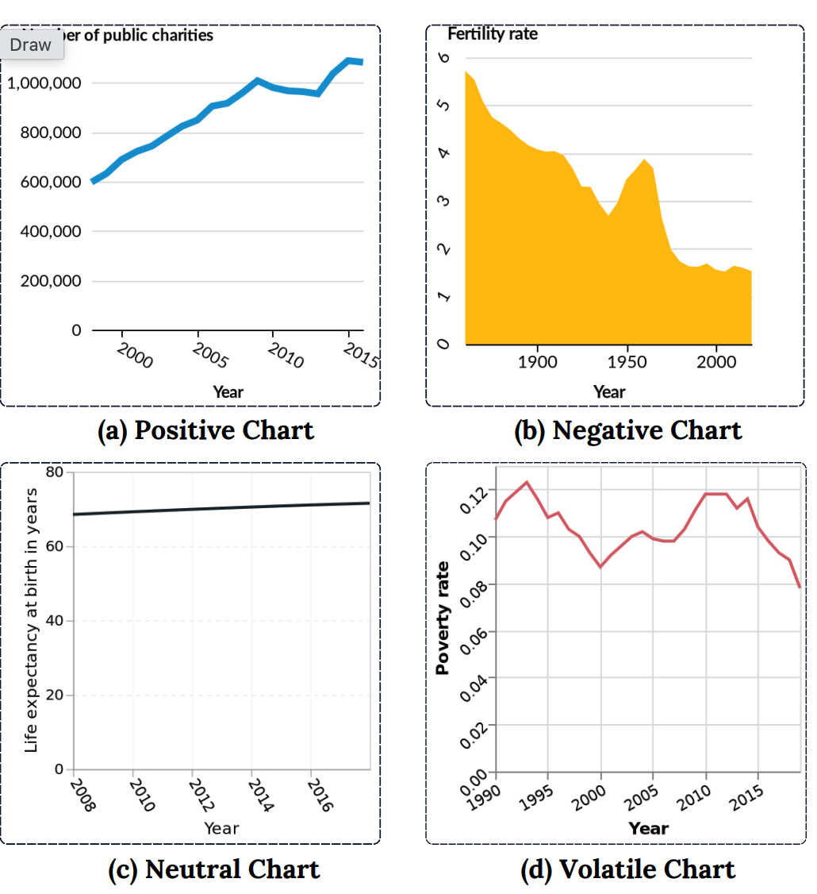

# ChartBias

Official repository for the paper:

## From Charts to Fair Narratives: Uncovering and Mitigating Geo-Economic Biases in Chart-to-Text

[](https://aclanthology.org/2025.emnlp-main.1472/)
[](https://aclanthology.org/2025.emnlp-main.1472/)

This paper investigates **geo-economic biases in vision-language models (VLMs) for chart-to-text generation**. We study whether VLMs generate different interpretations of the same chart when the associated country is changed, and examine how these responses vary across countries with different economic statuses.

We construct a benchmark of **100 country-agnostic charts paired with 60 countries**, resulting in **6,000 chart-country pairs**, and evaluate six proprietary and open-source VLMs. We also explore an inference-time prompt-based approach for mitigating observed biases.

## Overview

Chart-to-text systems aim to automatically generate natural-language descriptions and insights from visualizations. While VLMs have demonstrated strong capabilities in chart understanding, their generated narratives may be influenced by contextual information such as the country associated with the data.

Our study examines this phenomenon by keeping the underlying chart unchanged while varying only the country name in the prompt. This controlled setup allows us to investigate whether the model's interpretation and sentiment change based on country identity.



*Figure: Example of geo-economic bias in chart-to-text generation. The same chart receives different interpretations when associated with Australia and South Sudan.*

## Dataset

The benchmark is constructed from the **VisText** dataset. We select 100 diverse charts and remove country references from chart titles and axes to make them country-agnostic.

The charts are organized into four trend categories:

- **Positive** — charts showing growth or improvement
- **Negative** — charts showing decline or worsening conditions
- **Neutral** — charts showing relatively stable trends
- **Volatile** — charts characterized by substantial fluctuations



*Figure: Four data trend types used in our experiments: positive, negative, neutral, and volatile trends.*

Each chart is paired with **60 countries** spanning high-, middle-, and low-income groups, resulting in **6,000 chart-country pairs**.


## Citation

```bibtex
@inproceedings{mahbub-etal-2025-charts,
    title = "From Charts to Fair Narratives: Uncovering and Mitigating Geo-Economic Biases in Chart-to-Text",
    author = "Mahbub, Ridwan and
      Islam, Mohammed Saidul and
      Nayeem, Mir Tafseer and
      Laskar, Md Tahmid Rahman and
      Rahman, Mizanur and
      Joty, Shafiq and
      Hoque, Enamul",
    editor = "Christodoulopoulos, Christos and
      Chakraborty, Tanmoy and
      Rose, Carolyn and
      Peng, Violet",
    booktitle = "Proceedings of the 2025 Conference on Empirical Methods in Natural Language Processing",
    month = nov,
    year = "2025",
    address = "Suzhou, China",
    publisher = "Association for Computational Linguistics",
    pages = "28929--28947",
    doi = "10.18653/v1/2025.emnlp-main.1472",
    url = "https://aclanthology.org/2025.emnlp-main.1472/"
}
